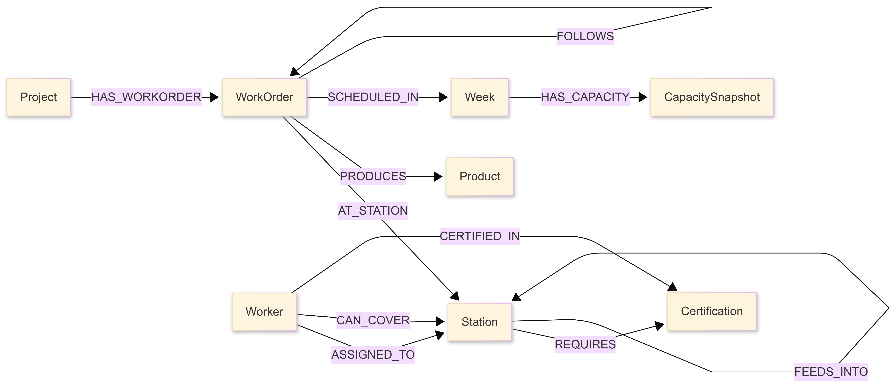
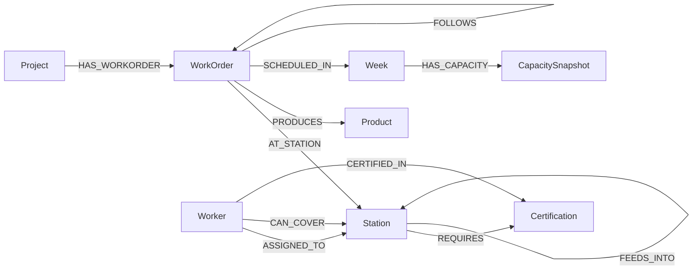

# Level 5 — Graph Schema

## Schema Diagram

---

## Mermaid Source

---

## Relationship Properties

| Relationship | Properties |
|---|---|
| `SCHEDULED_IN` | planned_hours, actual_hours, completed_units |
| `PRODUCES` | quantity, unit_factor |

---

## Node Labels

- `Project`
- `WorkOrder`
- `Station`
- `Product`
- `Week`
- `Worker`
- `Certification`
- `CapacitySnapshot`

---

## Relationship Types

- `HAS_WORKORDER`
- `AT_STATION`
- `PRODUCES`
- `SCHEDULED_IN`
- `FEEDS_INTO`
- `FOLLOWS`
- `ASSIGNED_TO`
- `CAN_COVER`
- `CERTIFIED_IN`
- `REQUIRES`
- `HAS_CAPACITY`