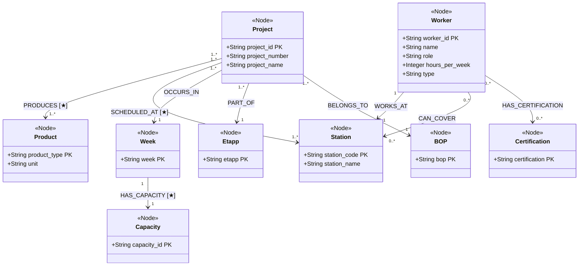

# Factory Knowledge Graph Schema

> Swedish steel fabrication production planning knowledge graph  
> Stack: Neo4j AuraDB · Python · Streamlit



---

## Node Reference

| Node Label | Properties | CSV Source |
|-----------|------------|------------|
| `Project` | project_id, project_number, project_name | factory_production.csv |
| `Product` | product_type, unit | factory_production.csv |
| `Station` | station_code, station_name | factory_production.csv |
| `Worker` | worker_id, name, role, hours_per_week, type | factory_workers.csv |
| `Week` | week | production + capacity data |
| `Etapp` | etapp | factory_production.csv |
| `BOP` | bop | factory_production.csv |
| `Certification` | certifications | factory_workers.csv |
| `Capacity` | capacity metrics | factory_capacity.csv |

---

## Relationship Reference

| Relationship | From → To | Properties |
|-------------|-----------|------------|
| `PRODUCES` | Project → Product | quantity, unit_factor |
| `SCHEDULED_AT` | Project → Station | planned_hours, actual_hours, completed_units |
| `OCCURS_IN` | Project → Week | — |
| `PART_OF` | Project → Etapp | — |
| `BELONGS_TO` | Project → BOP | — |
| `WORKS_AT` | Worker → Station | — |
| `CAN_COVER` | Worker → Station | — |
| `HAS_CERTIFICATION` | Worker → Certification | — |
| `HAS_CAPACITY` | Week → Capacity | own_hours, hired_hours, overtime_hours, total_capacity, total_planned, deficit |

---

## Relationship Property Examples

### Production Relationship

```cypher
(Project)-[:SCHEDULED_AT {
    planned_hours: 28.0,
    actual_hours: 35.0,
    completed_units: 8
}]->(Station)
```

---

### Product Output Relationship

```cypher
(Project)-[:PRODUCES {
    quantity: 450,
    unit_factor: 1.0
}]->(Product)
```

---

### Weekly Capacity Relationship

```cypher
(Week)-[:HAS_CAPACITY {
    own_hours: 400,
    hired_hours: 80,
    overtime_hours: 40,
    total_capacity: 520,
    total_planned: 645,
    deficit: -125
}]->(Capacity)
```

---

## Design Rationale

This schema models factory operations as a connected operational graph.

It captures:

- project production flow
- station scheduling
- workforce allocation
- backup staffing coverage
- worker certifications
- weekly capacity constraints
- production planning hierarchy

The graph structure allows natural traversal queries such as:

- Which workers can replace an absent station operator?
- Which stations are overloaded?
- Which projects contribute most to weekly deficits?
- Which certifications are critical bottlenecks?
- How does workforce coverage affect production risk?

This structure directly supports both operational analytics and dashboard visualization.