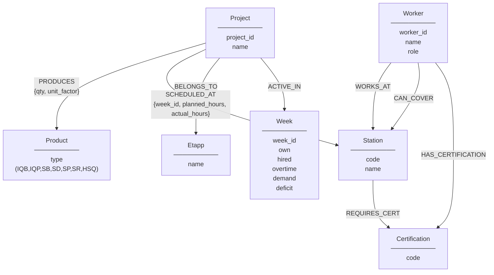

## Node Labels (7)

| Label | Properties | Source CSV | Count |
|-------|-----------|------------|-------|
| `Project` | project_id, name | factory_production.csv | 8 |
| `Product` | type | factory_production.csv | 7 |
| `Station` | code, name | factory_production.csv | 9 |
| `Worker` | worker_id, name, role | factory_workers.csv | 13 |
| `Week` | week_id, own, hired, overtime, demand, deficit | factory_capacity.csv | 8 |
| `Etapp` | name | factory_production.csv | 2+ |
| `Certification` | code | factory_workers.csv | varies |

## Relationship Types (8)

| Type | From → To | Properties | Count (approx) |
|------|-----------|------------|----------------|
| `PRODUCES` | Project → Product | qty, unit_factor | ~16 |
| `SCHEDULED_AT` | Project → Station | week_id, planned_hours, actual_hours | 68 (1 per CSV row) |
| `BELONGS_TO` | Project → Etapp | — | ~8 |
| `ACTIVE_IN` | Project → Week | — | ~40 |
| `WORKS_AT` | Worker → Station | — | 13 |
| `CAN_COVER` | Worker → Station | — | ~30 |
| `HAS_CERTIFICATION` | Worker → Certification | — | ~20 |
| `REQUIRES_CERT` | Station → Certification | — | ~9 |

**Total relationships: 200+ (well above 100 minimum)**
